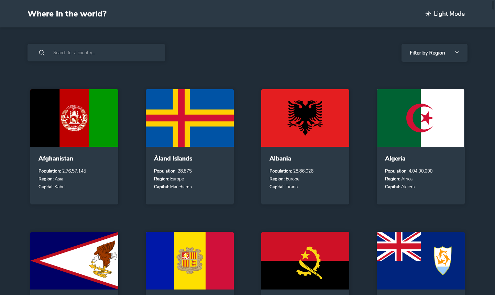
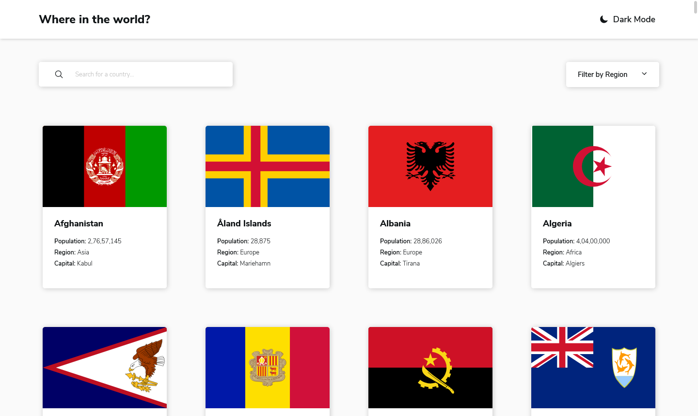
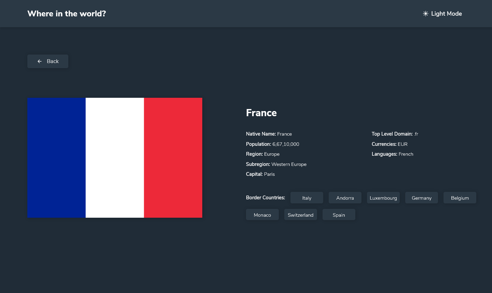
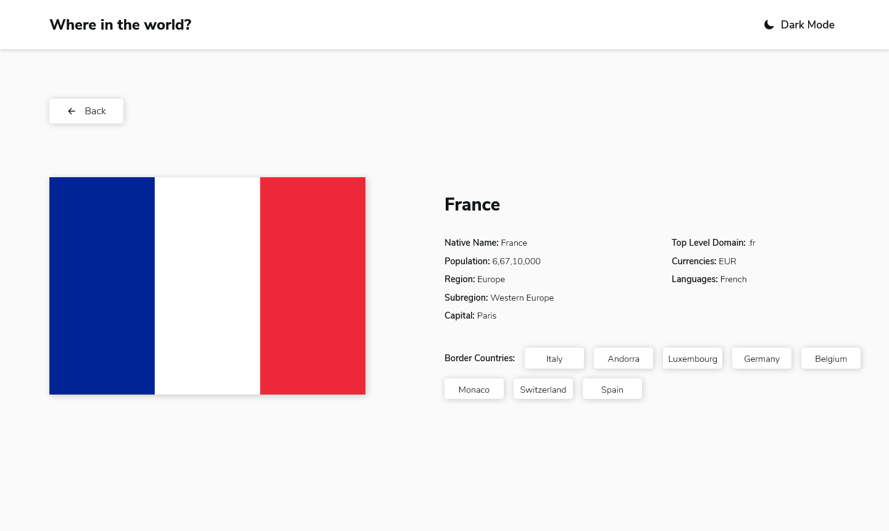
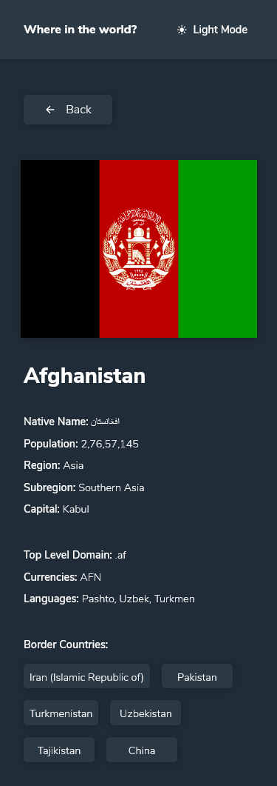
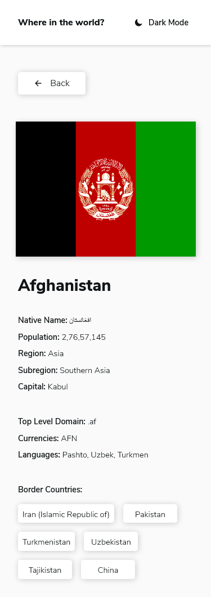

# Frontend Mentor - REST Countries API with color theme switcher solution

This is a solution to the [REST Countries API with color theme switcher challenge on Frontend Mentor](https://www.frontendmentor.io/challenges/rest-countries-api-with-color-theme-switcher-5cacc469fec04111f7b848ca). Frontend Mentor challenges help you improve your coding skills by building realistic projects.

## Table of contents

- [Overview](#overview)
  - [The challenge](#the-challenge)
  - [Screenshot](#screenshot)
  - [Links](#links)
- [My process](#my-process)
  - [Built with](#built-with)
  - [What I learned](#what-i-learned)
  - [Continued development](#continued-development)
  - [Useful resources](#useful-resources)
- [Author](#author)
- [Acknowledgments](#acknowledgments)

## Overview

### The challenge

Users should be able to:

- See all countries from the API on the homepage
- Search for a country using an `input` field
- Filter countries by region
- Click on a country to see more detailed information on a separate page
- Click through to the border countries on the detail page
- Toggle the color scheme between light and dark mode

### Screenshot

- Desktop home-page (dark mode)


- Desktop home-page (light mode)


- Desktop details page (dark mode)


- Desktop details page (light mode)


- Mobile details page (dark mode)


- Mobile details page (light mode)


### Links

- Solution URL: [Add solution URL here](https://your-solution-url.com)
- Live Site URL: [Add live site URL here](https://your-live-site-url.com)

## My process

### Built with

- Semantic HTML5 markup
- Flexbox
- [React](https://reactjs.org/) - JS library
- [Styled Components](https://styled-components.com/) - For styles
- [REST COUNTRIES](https://restcountries.eu/#api-endpoints-list-of-codes) - API

### What I learned

This is my first project where I used API to get data and display it on the site. I learned how to use endpoints and parameters according the need of the page. When you try to combine url by using props, don't use `"string" + {props.something} + "string"` as it won't properly format it as an url. Better example -

```js
let url = new URL(
  String(props.country),
  "https://restcountries.eu/rest/v2/name/"
);
url.searchParams.append("fullText", true);
```

### Useful resources

- [Search Bar in React Tutorial](https://www.youtube.com/watch?v=x7niho285qs)

## Author

- Linkedin - [Shashank Gupta](https://www.linkedin.com/in/shashank-gupta-789609144/)
- Frontend Mentor - [@Shashank1003](https://www.frontendmentor.io/profile/Shashank1003)
